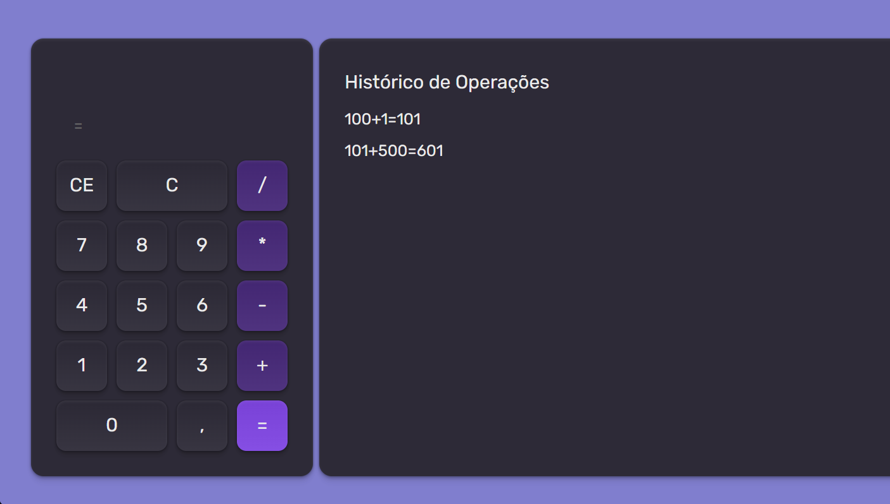

🧮 Calculadora React — Rocketseat Fundamentals

📖 Descrição

Projeto desenvolvido durante o curso Fundamentos de React da Rocketseat, uma calculadora moderna com histórico de operações e design inspirado no layout da trilha de aprendizado.

---

🚀 Tecnologias utilizadas

HTML5

CSS3 / TailwindCSS (via @tailwindcss/browser)

React 18

React DOM 18

Babel Standalone (para interpretar JSX direto no navegador)

LocalStorage API (para salvar o histórico de operações)

---

💡 Funcionalidades

Realiza operações básicas: +, -, \*, /

Suporte a vírgula decimal

Botões C (limpa tudo) e CE (limpa último caractere)

Exibe resultado e operação atual em tempo real

Histórico persistente salvo no LocalStorage

---

📸 Preview

🧑‍💻 Autor

Desenvolvido por Michele Silva 💜
Durante o curso Fundamentos de React da Rocketseat.
